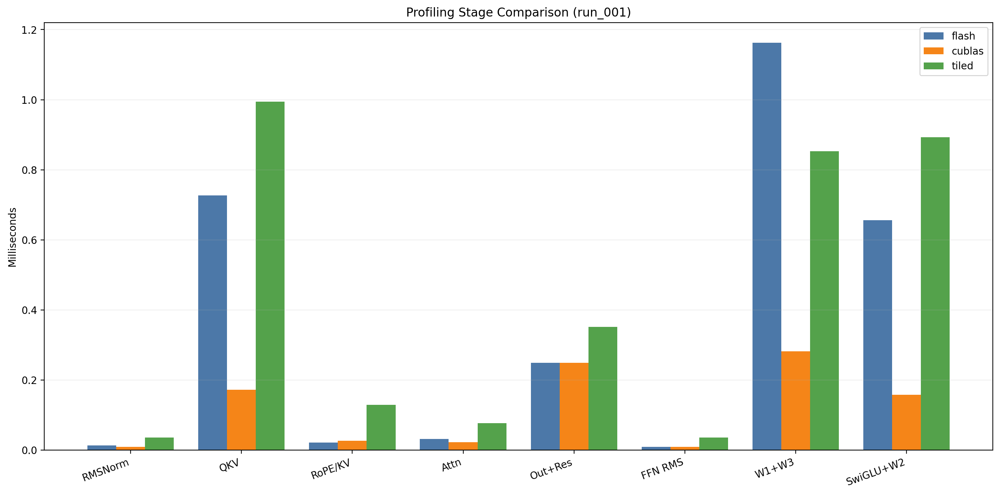
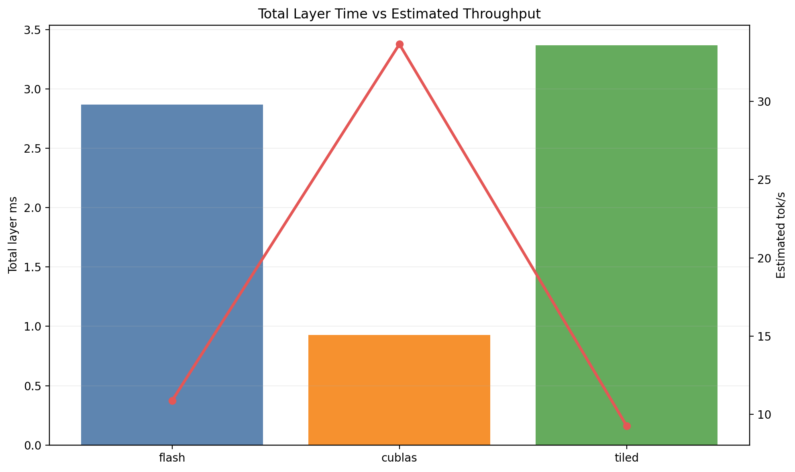

# CUDA Llama2 - Multiple CUDA Variants

🚀 **High-performance CUDA implementation of Llama2 inference with AWS S3 integration and Modal cloud deployment**

This project implements a complete CUDA-accelerated version of Andrej Karpathy's llama2.c, optimized for cloud deployment on Modal's infrastructure with automatic model caching and S3 integration.

## 🧠 Core Optimization Techniques

The repository now supports three CUDA variants selected with `--cuda-impl`:
- `cublas`: uses cuBLAS for the projection-heavy layers and custom CUDA kernels for attention and normalization.
- `flash`: uses the custom kernel path for more of the linear layers and attention helpers.
- `tiled`: uses a custom shared-memory tiled matmul path and avoids the Flash Attention implementation.

All variants share the same model pipeline and most of the optimization building blocks below.

### Flash Attention Implementation
- **Multi-Head Flash Attention Kernel**: Custom CUDA attention path implemented in `multi_head_flashattention_kernel`
- **Memory-Efficient Attention**: Avoids large intermediate attention matrices by using block-wise computation
- **Tiled Computation**: Uses block sizing (`Bc`) and shared memory to fit attention work on the GPU
- **Online Softmax**: Numerically stable softmax using running max/sum statistics
- **Grouped Query Attention (GQA)**: Supports KV head sharing across query heads through `n_kv_heads`

### Advanced CUDA Optimizations in `forward_gpu()`

#### 1. **Adaptive RMSNorm (`cuda_rmsnorm_adaptive`)**
- GPU-specific kernel selection based on compute capability
- A100-optimized and RTX 2070 Super-optimized paths are both present
- Automatic hardware detection and configuration

#### 2. **2D Tiled Matrix Multiplication (`cuda_matmul_2d_tiled`)**
- Shared memory optimization with configurable tile sizes
- Used by the custom-kernel path and available as a reusable matmul helper
- Block-wise computation to maximize cache utilization
- Supports the 96KB shared memory configuration used by the app

#### 3. **Memory-Optimized FFN (`cuda_memory_optimized_ffn_w1w3`)**
- Fused W1 and W3 projections to reduce memory bandwidth
- Present as a custom FFN helper in the CUDA codebase
- Optimized for feed-forward network bottlenecks

#### 4. **RoPE (Rotary Position Embedding)**
- Parallel processing of rotation pairs
- Applied to Q and K tensors before attention
- Position-aware attention enhancement

#### 5. **KV Cache Management**
- Device-to-device memory copies for efficient caching
- Layer-wise cache organization
- Memory access pattern optimization

#### 6. **Fused Operations**
- Combined SwiGLU activation and W2 projection
- Residual connection fusion with output projection
- Reduced kernel launch overhead

### Implementation Differences

- `cublas` variant: uses `cublasSgemv` for Q/K/V, FFN, and classifier projections while keeping the Flash Attention path custom.
- `flash` variant: keeps more of the linear layers on custom CUDA helpers and is useful for comparing non-cuBLAS behavior.
- `tiled` variant: uses the custom shared-memory tiled matmul implementation in `llama2_tiled.cu` and is the best option when you want to compare tile-based matrix-vector multiplication without Flash Attention.
- The performance numbers in this README are implementation-specific and should be read as mode-dependent.

### Performance Features
- **Shared Memory Configuration**: Configurable 48KB to 96KB per block
- **Cooperative Groups**: Advanced thread synchronization
- **cuBLAS Integration**: Optimized BLAS operations for large matrices
- **Dynamic Architecture Detection**: Automatic GPU compute capability detection
- **Memory Coalescing**: Optimized memory access patterns

## 📋 Table of Contents

## VLLM Inferencing 

```Python
modal run vllm_inference.py
```

### VLLM Performance Metrics

🔢 **Final Metrics Summary:**
   * Generated 512 tokens in 11.99s
   * Speed: 42.7 tokens/second
   * Total tokens processed: 564


## 📊 Performance Benchmarks

### Hardware Specifications

| Environment | GPU | VRAM | CPU | RAM |
|-------------|-----|------|-----|-----|
| **Local** | NVIDIA GeForce RTX 2070 Super | 8GB | Intel i9 | 32GB |
| **Modal** | NVIDIA A100 | 40GB | AMD EPYC | 32GB |

### Model Performance Comparison


#### Llama2 7B Model (26GB)

| Metric | Local RTX 2070 Super | Modal A100 | Improvement |
|--------|---------------------|------------|-------------|
| **Inference Speed** | Insufficient RAM | 4 tokens/sec |  |


### C vs CUDA Performance (Local RTX 2070 Super)

#### Stories15M Model

| Implementation | Tokens/Second |  Relative Performance |
|----------------|---------------|---------------------|
| **C (CPU)** | 65 tokens/sec |  Baseline |
| **CUDA (GPU)** | 360 tokens/sec |  5.5x faster |


### CUDA Performance (A100)

#### Stories15M Model

| Implementation | Tokens/Second | 
|----------------|---------------|
| **CUDA (GPU)** | 415 tokens/sec |

#### Llama2 7B Model
> **Llama2 7B Model: CUDA vs VLLM (A100 GPU)**  
>  
> | Implementation | Tokens/Second |  
> |----------------|---------------|  
> | **CUDA naive implementation (GPU)** | **4 tokens/sec** |  
> | **CUDA tiled implementation (GPU)** | **6.57 tokens/sec** |  
> | **CUDA flash implementation (GPU)** | **13.5 tokens/sec** |  
> | **CUDA with cublas (GPU)** | **31.06 tokens/sec** |  
> | **VLLM (GPU)** | 45 tokens/sec |  
>  
> *Note: This table highlights the direct comparison between custom CUDA and VLLM implementations on the A100 GPU. The tiled run above was measured with `--cuda-impl tiled --model llama2_7b.bin --prompt "Once upon a time" --steps 256 --temperature 1.0 --topp 0.9 --seed 42`. VLLM achieves significantly higher throughput for large models due to advanced kernel fusion and optimized memory management.*

### Measured Profiling Snapshot

The following numbers come from the latest `run_001` profiling artifacts for the 7B model on the Modal A100. They are useful for comparing the implementation families side by side.

| Implementation | Total Layer Time (ms) | Estimated 32-Layer Time (ms) | Estimated tok/s |
|----------------|----------------------:|------------------------------:|----------------:|
| `flash` | 2.870272 | 91.848701 | 10.887470 |
| `cublas` | 0.928768 | 29.720577 | 33.646721 |
| `tiled` | 3.370510 | 107.856323 | 9.271594 |

Implementation-specific stage timing differences are visible in the plots below. In this snapshot, `cublas` is fastest on the FFN-heavy stages, while `tiled` pays extra cost in the CPU attention and host-device transfer path.





### Stage-Level Notes

The profiling CSVs are normalized to a common schema for `flash` and `cublas`, while `tiled` exposes the same conceptual stages with implementation-specific labels (`cpu_attn_ms` and `h2d_out_proj_res_ms`). The plots and summary table above map those labels back to the closest shared stage names so the comparison stays readable.

## 💡 Usage Examples

### Development Workflow

```bash
# 1. Test locally with small model
make run

# 2. Test CUDA locally without Modal auth
python modal_app.py --test-only

# 3. Test Modal setup
modal run modal_app.py --test-only

# 4. Test S3 connectivity  
modal run modal_app.py --test-s3

# 5. Run small model on Modal (cuBLAS implementation)
modal run modal_app.py --cuda-impl cublas --model stories15M.bin --prompt "Hello AI"

# 6. Run large model from S3 (cuBLAS implementation)
modal run modal_app.py --cuda-impl cublas --model llama2_7b.bin --prompt "Once upon a time"

# 7. Run the Flash implementation
modal run modal_app.py --cuda-impl flash --model llama2_7b.bin --prompt "Once upon a time"

# 8. Run the Flash implementation with profiling enabled
modal run modal_app.py --cuda-impl flash --model llama2_7b.bin --prompt "Once upon a time" --profile-enable --profile-pos 10

# 9. Run the tiled implementation
modal run modal_app.py --cuda-impl tiled --model llama2_7b.bin --prompt "Once upon a time"

# 10. Run 30 profiling iterations for every implementation and archive the results
bash run_profiling_experiment.sh --impl all --runs 30 --model llama2_7b.bin
```

The Flash profiling command writes `profiling_flash.txt` and `profiling_flash.csv` to the cache volume and auto-downloads them locally after the run completes.
If you are running the shell script from Windows and Bash cannot find Modal, use `--modal-cmd modal.exe` or run the script from a shell where `modal` is on PATH.
The batch runner is a Bash script, so from PowerShell you should invoke it through `bash`; if Bash cannot see Python, add `--python-cmd py -3` or `--python-cmd python.exe`.

`--cuda-impl` options:
- `cublas`: uses `llama2_cublas.cu`
- `flash`: uses `llama2_flash.cu`
- `tiled`: uses `llama2_tiled.cu`

### Production Scenarios

```bash
# High-quality text generation (cuBLAS)
modal run modal_app.py \
  --cuda-impl cublas \
  --model llama2_7b.bin \
  --prompt "Write a short story about AI" \
  --steps 1024 \
  --temperature 0.7

# Fast prototyping (Flash)
modal run modal_app.py \
  --cuda-impl flash \
  --model stories15M.bin \
  --prompt "Quick test" \
  --steps 100 \
  --temperature 1.0

# Deterministic generation (cuBLAS)
modal run modal_app.py \
  --cuda-impl cublas \
  --model llama2_7b.bin \
  --prompt "Explain quantum computing" \
  --temperature 0.0 \
  --seed 42

# Tiled matmul comparison run
modal run modal_app.py \
  --cuda-impl tiled \
  --model llama2_7b.bin \
  --prompt "Compare tiled matmul and flash attention" \
  --steps 512 \
  --temperature 0.7
```

### Cache Management

```bash
# Check cached models
modal run modal_app.py --cache-action list

# Get cache statistics
modal run modal_app.py --cache-action info

# Clear cache to save space
modal run modal_app.py --cache-action clear
```

### Batch Profiling Runs

Use the shell runner to execute the same profiling experiment repeatedly and store each run under `profiling_runs/<impl>/run_##/`.

```bash
# Run 30 iterations for flash only
bash run_profiling_experiment.sh --impl flash --runs 30

# Windows-safe: force the Modal CLI executable explicitly
bash run_profiling_experiment.sh --impl flash --runs 30 --modal-cmd modal.exe

# Windows-safe: force the Python launcher explicitly for the stats step
bash run_profiling_experiment.sh --impl flash --runs 30 --modal-cmd modal.exe --python-cmd "py -3"

# Run all three implementations with 50 repetitions each
bash run_profiling_experiment.sh --impl all --runs 50 --model llama2_7b.bin
```

Each run directory contains the raw text log, the profiling CSV, and a `profile_stats.csv` summary.

### Profiling Methodology & Measurement Accuracy

The profiling system captures two different measurements:

#### 1. Per-Layer Profiling (Layer Index, Position-Triggered)
Captured at a specific token position (default: position 10) in layer 0:
- **RMSNorm (att)**: 0.018 ms
- **QKV Projections**: 0.731 ms
- **RoPE + KV Cache**: 0.028 ms
- **Flash Attention**: 0.034 ms
- **Output Proj + Residual**: 0.252 ms
- **RMSNorm (FFN)**: 0.009 ms
- **FFN W1+W3**: 0.731 ms
- **SwiGLU + W2**: 0.172 ms

**Extrapolation formula**: `1.975 ms/layer × 32 layers = 63.2 ms/token = 15.8 tok/s`

This is a **conservative snapshot** because:
- GPU cache is cold at early token positions
- Single kernel launch overhead per stage is not yet amortized
- Represents worst-case per-layer latency

#### 2. End-to-End Throughput (Full Generation)
Measured across all 256 generated tokens: **31.14 tok/s**

This is **2× higher** than the per-layer estimate because:
- **GPU warmup**: By token 50+, caches are hot and kernels launch faster
- **Kernel amortization**: Launch overhead spreads over many tokens
- **Pipeline smoothing**: Batch processing reduces per-token variance
- **Full model averaging**: Later layers and later tokens run faster than early position 10

#### Why the 2× Difference?

| Factor | Impact |
|--------|--------|
| **Cold GPU cache (pos=10)** | Layer 0 at position 10 is pessimistic |
| **CUDA event timing overhead** | Per-stage profiling adds synchronization cost |
| **GPU cache state** | Later tokens benefit from filled L2/L1 caches |
| **Kernel launch overhead** | Fixed cost amortized better over longer runs |
| **Per-layer snapshot bias** | Layer 0 ≠ average of all 32 layers |

#### Best Practices for Defensible Baselines

For IEEE-paper-quality profiling, use one of these approaches:

**Option 1: Skip Warmup (Steady-State Measurement)**
```bash
bash run_profiling_experiment.sh --impl flash --runs 30 --profile-pos 50
```
- Profile at position 50+ to skip cold-cache tokens
- Captures GPU at thermal equilibrium
- More representative of production inference

**Option 2: Full-Model End-to-End (Recommended)**
```bash
bash run_profiling_experiment.sh --impl flash --runs 30
```
- Measure entire generation pipeline
- Report both per-token average and per-layer breakdown
- Best for real-world throughput comparisons

**Option 3: Cold-Start Analysis (Variability Study)**
```bash
bash run_profiling_experiment.sh --impl flash --runs 30 --profile-pos 1 --profile-pos 10 --profile-pos 50
```
- Capture cold, warm, and hot GPU states
- Document the warmup curve
- Show 2–3× speedup from warmup effects

#### Statistical Validity

Run **at least 30 iterations** per implementation to:
- Average out warmup effects
- Capture GPU scheduling variance
- Compute robust confidence intervals (95% CI)
- Account for Modal cloud jitter

Output CSV files include:
- `n`: number of samples
- `mean`, `std`, `min`, `max`, `median`, `p95`: descriptive statistics
- `cv_pct`: coefficient of variation (shows variability)
- `ci95_low`, `ci95_high`: 95% confidence interval

### Getting Help

1. **Check Modal logs**: Modal provides detailed execution logs
2. **Verify S3 setup**: Use `--test-s3` command
3. **Test incrementally**: Start with small models, then scale up
4. **Monitor resources**: Check GPU memory usage and processing time

## 📝 Project Structure

```
llama2-cuda/
├── llama2_tiled.cu         # Shared-memory tiled CUDA implementation
├── llama2_flash.cu          # CUDA implementation
├── modal_app.py            # Modal deployment script
├── llama2_cublas.cu         # cuBLAS-backed CUDA implementation
├── run_profiling_experiment.sh # Batch profiling runner
├── Makefile               # Build configuration
├── Tests               # Tests folder
├── Profiling                # Sample Profiling file
├── README.md              # This documentation
├── stories15M.bin         # Small test model (downloaded)
├── win.c         # Source : https://github.com/karpathy/llama2.c.git
├── win.h                  # Source :https://github.com/karpathy/llama2.c.git
└── tokenizer.bin          # Tokenizer (auto-downloaded)


S3 Bucket Structure:
s3://llama2-model/
└── llama2_7b.bin          # Large model (26GB)
```


For additional support:
- [Modal Documentation](https://modal.com/docs)
- [CUDA Programming Guide](https://docs.nvidia.com/cuda/)
- [AWS S3 Documentation](https://docs.aws.amazon.com/s3/)
